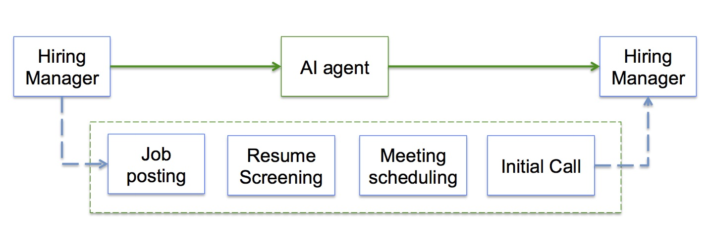

## HR AI Agent
This repo provides a solution to replace part of HR job with AI, such resume screening, email scheduling and initial phone call to candidates all in AI.

it consists of four services:

1. **Chat:** provides chat to help write job posts, polish resume, etc

2. **processor:** provoides workflow to screen resume and schedule meeting

3. **subscription:** handle payment for subscription

4. **voice:** inital phone call to candidates

5. **website:** webUI for the above services (user login, resume screening/meeting scheduling, chat, etc)

## How it works
The purpose is to replace HR with this AI agent to do job posting, resume screening, scheduling and initial phone call. The whole pipeline is below:

Users need to go to each fold to run services above (do not forget to modify port number for each service)

## Pre-requisites
**Twilio account**: we use Twilio for voice service

**Stripe account**: we use stripe for payment service

**Google cloud**: we use gmail for resume screening and google calendar to scheudle meeting

**LLMs**: create LLM account such as google gemini or openai chatgpt, either works

Please go to each fold to get more details while running the service

## Contributing

We welcome contributions to the project! If you find any issues or have suggestions for improvements, please open an issue or submit a pull request on the [GitHub repository](https://github.com/vividitytech/hrAgent).

---

We hope you enjoy exploring the **hrAgent** project and find valuable insights into the world of data analysis. If you have any questions or need assistance, feel free to reach out to us newhorizontalinc@gmail.com.

Thank you for visiting!
