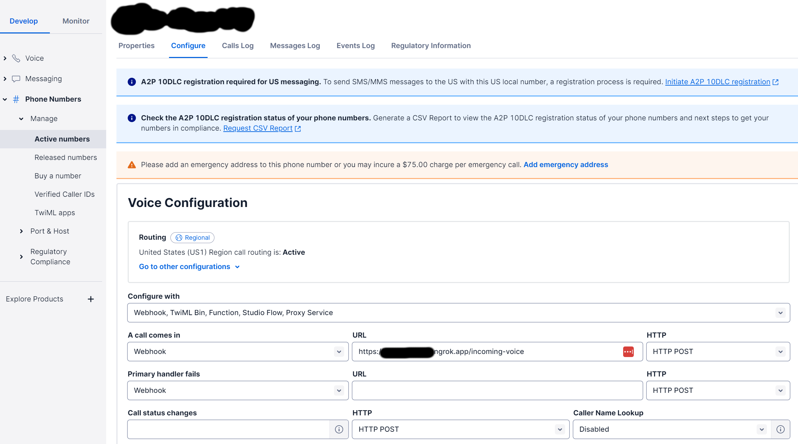

## AI Voice call
This server will loop Google calendar and make initial call to candidates
Use Gemini over Twilio to create an AI phone agent (works for incoming or outgoing calls).

## How it works

Twilio Webhook -> Flask app -> Twilio Media Stream (websocket) -> Whisper -> gemini API -> vits -> Twilio Play Audio


## Pre-requisites


### Install google-genai and whisper

1. `pip install google-genai`, or git clone
2. `pip install git+https://github.com/openai/whisper.git`, or git clone and put it under voice fold
3. `git clone https://github.com/saisyam/pywav` and put it under voice fold


### Clone vits and copy it to voice folder
1. `git clone https://github.com/jaywalnut310/vits`
2.  Download the model [pretrained models](https://drive.google.com/drive/folders/1ksarh-cJf3F5eKJjLVWY0X1j1qsQqiS2?usp=sharing)
and put the model under vits/config


### Twilio Setup
1. create try account in Twilio website
2. download ngrok, install it, and run
3. set up tunnel which link your local serer to Twilio 

This will create an ngrok tunnel and provide a webhook URL to point to in Twilio settings for a purchased phone number.



resources/twilio_setting_config.png

4. Setup environment variables (create .env file and add the following info)

```
OPENAI_API_KEY=
GOOGLE_API_KEY=
TWILIO_ACCOUNT_SID=
TWILIO_AUTH_TOKEN=
TWILIO_PHONE_NUMBER=
```

### Enable Google Calendar API
In your Google Cloud Project, enable the Google Calendar API. Search for "Google Calendar API" in the API Library and enable it.

## Demo

### Test the voice chat

Try `python ai_client_test.py` to chat with GPT through terminal.


### Run the voice chat server

Try `python ai_server.py` to start the voice call center.

### Usage example with code snippets
```python
from ai_server import TwilioAIAssistant
import logging
import time

logging.getLogger().setLevel(logging.INFO)

tws = TwilioAIAssistant(remote_host="cc3b-74-94-77-238.ngrok-free.app", port=8080)
# Point twilio voice webhook to https://abcdef.ngrok.app/audio/incoming-voice
tws.start()

# You can also have ChatGPT actually start the call, e.g. for automated ordering
# tws.start_call("+18321231234")
```
Remember to repace the remote_host with your url from ngrok